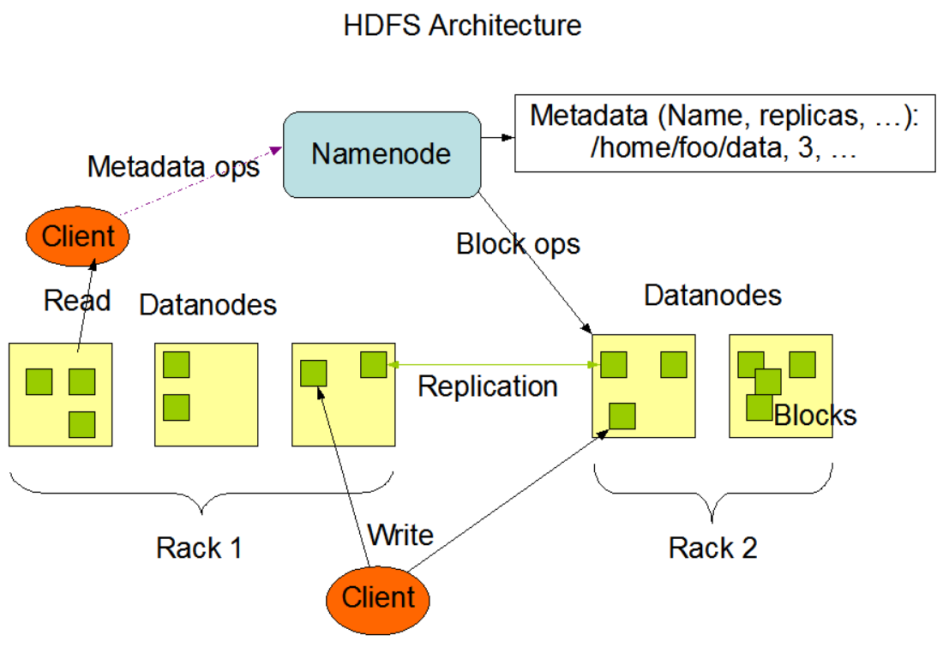

# Hadoop
## HDFS
### HDFS架构

● Client：客户端
  ○ 切分文件。文件上传HDFS的时候，client将文件切分为一个一个的Block，然后进行存储。
  ○ 与NameNode交互，获取文件的位置信息
  ○ 与DataNode交互，读取或者写入数据
  ○ client提供一些命令来管理HDFS，比如启动关闭HDFS、访问HDFS目录及内容。
● NameNode：名称结点，也称主节点，存储数据的元数据信息，不存储具体的数据
  ○ 管理HDFS的名称空间
  ○ 管理数据块Block映射信息
  ○ 配置副本策略
  ○ 处理客户端的读写请求
● DataNode: 数据节点，也称从节点。NameNode下达命令，DataNode执行实际操作。
  ○ 存储实际的数据块
  ○ 执行数据块的读/写操作
● Secondary NameNode：并非NameNode的热备。当NameNode挂掉的时候，它并不能马上替换NameNode并提供服务。
  ○ 辅助NameNode，分担其工作量
  ○ 定期合并Fsimage和Edits，并推送给NameNode
  ○ 在紧急情况下，可辅助回复NameNode
